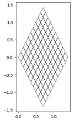
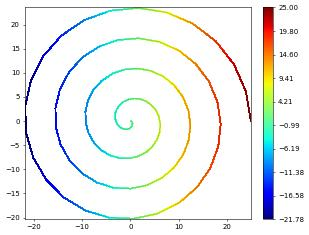

.. code:: ipython3

    from matplotlib import pyplot
    from ufl import sqrt, SpatialCoordinate, triangle, as_vector
    from dune.grid import structuredGrid
    from dune.fem.view import geometryGridView
    from dune.fem.function import gridFunction
    square = structuredGrid([0,0],[1,1],[10,10])
    x = SpatialCoordinate(triangle)
    transform = as_vector([ (x[0]+x[1])/sqrt(2), (-x[0]+x[1])*sqrt(2) ])
    diamond = gridFunction(transform,square,order=1,name="diamond")
    diamond = geometryGridView(diamond)

.. code:: ipython3

    diamond.plot()

In a second example we embed a 1D interval into 3D:

.. code:: ipython3

    from ufl import interval,cos,sin
    square = structuredGrid([0],[25],[100])
    theta = SpatialCoordinate(interval)[0]
    transform = as_vector([cos(theta),sin(theta)])*(25-theta)
    diamond = gridFunction(transform,square,order=1,name="diamond")
    spiral = geometryGridView(diamond)

Note: currently plotting for 1d grids is not implemented spiral.plot()
but we can plot some grid function, e.g., given by ufl expressions

.. code:: ipython3

    from dune.fem.plotting import plotPointData as plot
    plot(theta, gridView=spiral)

